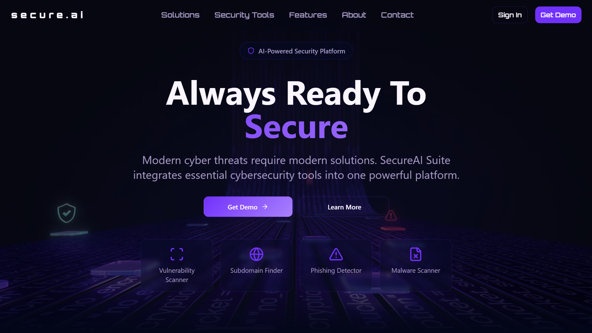
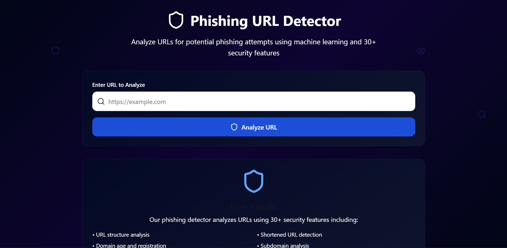

# 🛡️ Secure AI

**Comprehensive cybersecurity platform with ML-powered vulnerability scanning**

[](https://opensource.org/licenses/MIT)
[](https://react.dev)
[](https://fastapi.tiangolo.com)
[](https://secure-ai.netlify.app)

## 📋 Overview

Secure AI is a comprehensive cybersecurity platform providing multiple security scanning and analysis tools. The platform combines a modern React frontend with a robust FastAPI backend to deliver vulnerability scanning, phishing detection, subdomain discovery, and AI-powered security fix generation.

The architecture leverages machine learning models trained on security features and integrates with industry-standard security tools like **pip-audit**, **npm audit**, and **osv-scanner** to provide multi-language vulnerability detection across 15+ programming languages.

The platform features async/await architecture for concurrent processing, **Google Gemini AI** integration for intelligent fix generation, and production-ready deployments on **Netlify** (frontend) and **Render** (backend).

## ✨ Key Features

### 🔍 Multi-language Vulnerability Scanner
- CVE detection across 15+ programming languages (Python, Node.js, Go, Java, Rust, Ruby, PHP, and more)
- AI-powered security fix generation using Google Gemini
- Detailed vulnerability reports with confidence scoring

### 🚨 ML-powered Phishing URL Detector
- Random Forest model trained on 30+ security features
- 95%+ accuracy in phishing detection
- Real-time URL analysis with confidence scoring

### 🌐 Subdomain Finder
- Certificate Transparency integration
- SecurityTrails API integration
- Comprehensive subdomain discovery

### 📊 Real-time Security Analysis
- Concurrent processing with async/await architecture
- Confidence scoring for all detections
- Detailed vulnerability assessments

### 📄 PDF Report Generation
- Professional scan result reports
- Vulnerability assessment documentation
- Export-ready format

## 📸 Screenshots

### Main Dashboard


### Vulnerability Scanner


### Phishing Detection


---

## 🚀 Quick Start

### Prerequisites
- **Node.js** 18.0 or higher
- **Python** 3.9 or higher
- **npm** or **bun** package manager

### Frontend Setup

1. **Clone the repository**
   ```bash
   git clone https://github.com/yourusername/secure-ai.git
   cd secure-ai
   ```

2. **Install dependencies**
   ```bash
   npm install
   # or
   bun install
   ```

3. **Start development server**
   ```bash
   npm run dev
   # or
   bun dev
   ```

4. **Build for production**
   ```bash
   npm run build
   ```

### Backend Setup

Refer to the backend repository for FastAPI setup instructions.

## 🛠️ Tech Stack

### Frontend
- **React** - UI framework
- **TypeScript** - Type safety
- **Vite** - Build tool
- **Tailwind CSS** - Styling
- **Framer Motion** - Animations
- **Shadcn/ui** - Component library

### Backend
- **FastAPI** - Python web framework
- **Python** - Backend language
- **Scikit-learn** - Machine learning models
- **PostgreSQL** - Database
- **Google Gemini** - AI fix generation

### Tools & Services
- **pip-audit** - Python vulnerability scanning
- **npm audit** - Node.js vulnerability scanning
- **osv-scanner** - Multi-language vulnerability detection
- **Certificate Transparency** - Subdomain discovery
- **SecurityTrails** - Security intelligence

## 🎯 How It Works

### Vulnerability Scanning Process
1. User submits repository URL or code
2. Tool detection based on manifest files (requirements.txt, package.json, etc.)
3. Appropriate security tools execute concurrently
4. ML model processes and ranks vulnerabilities
5. Google Gemini generates intelligent security fixes
6. Results compiled into comprehensive report

### Phishing Detection Process
1. User submits URL for analysis
2. 30+ security features extracted from URL
3. Random Forest classifier predicts phishing probability
4. Confidence score and detailed analysis provided
5. Real-time results with explanations

### Subdomain Discovery
1. Certificate Transparency logs queried
2. SecurityTrails API integration for additional intelligence
3. Results aggregated and deduplicated
4. Comprehensive subdomain report generated

## 📊 Performance & Impact

- **50+** users actively scanning repositories for security vulnerabilities
- **95%+** accuracy in phishing URL detection
- Support for **15+** programming languages
- **1000+** CVEs covered
- **50%** faster vulnerability detection with async processing
- Integrated with **Google Gemini AI** for intelligent security fix generation

## 🏗️ Architecture Highlights

### Frontend Architecture
- Component-based React architecture
- TypeScript for type safety
- Responsive design with Tailwind CSS
- Smooth animations with Framer Motion
- Modular UI components from Shadcn

### Backend Architecture
- Async/await with FastAPI for concurrent processing
- Machine learning models for phishing detection
- Integration with multiple security scanning tools
- Intelligent error handling and timeouts
- Production-ready with proper logging

### Data Flow
1. Frontend collects user input
2. Sends request to FastAPI backend
3. Backend detects tools and runs concurrent scans
4. ML models process results
5. AI generates intelligent fixes
6. Results returned to frontend
7. PDF report generation and export

## 🎓 Technical Challenges & Solutions

### Challenge: Integrating Multiple Security Tools
**Solution:** Implemented tool detection based on manifest files (requirements.txt, package.json, etc.)

### Challenge: Processing Large Repositories Efficiently
**Solution:** Used async/await architecture with aiohttp for concurrent processing and intelligent caching

### Challenge: Building Accurate Phishing Models
**Solution:** Trained Random Forest Classifier with 30+ engineered security features achieving 95%+ accuracy

### Challenge: Maintaining API Response Consistency
**Solution:** Built async backend with proper error handling and request timeouts

### Challenge: Model Persistence & Deployment
**Solution:** Deployed trained models using joblib with version control for reproducibility

## 🔐 Security Considerations

- All external API calls validated and sanitized
- Models deployed securely with version control
- Regular vulnerability assessments
- Production deployments with environment variable protection
- HTTPS enforced for all communications

## 🚀 Deployment

### Frontend
- **Hosting:** Netlify
- **Auto-deployment:** On push to main branch
- **Performance:** Optimized builds with Vite

### Backend
- **Hosting:** Render
- **Runtime:** Python environment with dependencies
- **Database:** PostgreSQL managed instance

## 📝 Project Structure

```
secure-ai/
├── src/
│   ├── components/        # React components
│   ├── pages/            # Page components
│   ├── hooks/            # Custom React hooks
│   ├── lib/              # Utility functions
│   ├── api/              # API route handlers
│   └── assets/           # Static assets
├── public/
│   ├── images/           # Screenshots and images
│   ├── icons/            # Icon assets
│   └── robots.txt
├── vite.config.ts        # Vite configuration
├── tsconfig.json         # TypeScript configuration
├── tailwind.config.ts    # Tailwind CSS configuration
└── package.json          # Project dependencies
```

## 🤝 Contributing

Contributions are welcome! Please follow these steps:

1. Fork the repository
2. Create a feature branch (`git checkout -b feature/amazing-feature`)
3. Commit your changes (`git commit -m 'Add amazing feature'`)
4. Push to the branch (`git push origin feature/amazing-feature`)
5. Open a Pull Request

## 📄 License

This project is licensed under the MIT License - see the LICENSE file for details.

## 🙋 Support

For issues, questions, or suggestions, please:
- Open an issue on GitHub
- Contact the development team
- Check documentation at [https://secure-ai.netlify.app](https://secure-ai.netlify.app)

## 🌟 Acknowledgments

- Built with [React](https://react.dev) and [TypeScript](https://www.typescriptlang.org)
- Security tools: pip-audit, npm audit, osv-scanner
- ML frameworks: Scikit-learn
- AI powered by [Google Gemini](https://deepmind.google/technologies/gemini/)
- UI components from [Shadcn/ui](https://ui.shadcn.com)

## 📅 Project Timeline

**Year:** 2025

**Live Demo:** [https://secure-ai.netlify.app](https://secure-ai.netlify.app)

**Category:** Cybersecurity / ML Platform

---

<p align="center">
  Built with ❤️ for the security community
</p>
